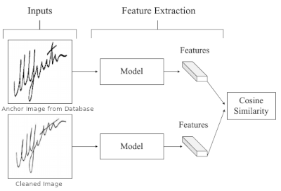
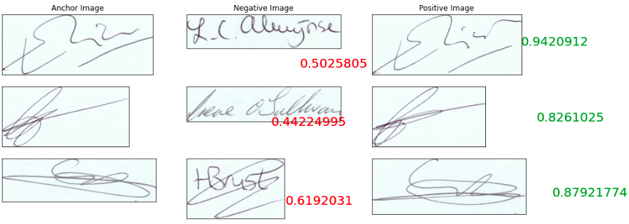

# Signature Verification using Representation Learning
  
[Offline Signature Verification on Real-World Documents](https://arxiv.org/abs/2004.12104) paper describes a method to signature verification method by learning the features or representations that are important for the signature.  
  
Writer independent signature representations are learned during the training period. The model generalizes to learn the features that are defining for a signature. This eliminates the need to retrain the model every time a new user is added to the system. Thus any number of new users could be added or removed from the system without hurting the model performance.  
  
The [paper](https://arxiv.org/abs/2004.12104) uses [VGG16](https://arxiv.org/abs/1409.1556) and [ResNet50](https://arxiv.org/abs/1512.03385) pre-trained on ImageNet for extracting the features. These models are fine-tuned on the [Kaggle Signature Dataset](https://www.kaggle.com/robinreni/signature-verification-dataset).  
  
The paper suggests using the first fully-connected layer of VGG-16 and the second last convolution layer of ResNet-50 are chosen for feature extraction. A pair of signatures, which we want to verify is fed into the models parallely to extract the feature vector. Accordingly, we obtain a feature vector with size of 4096 from VGG-16 and a feature vector size of 25088 from ResNet-50. These vectors would be representative of the signatures. Later we use [cosine similarity](https://en.wikipedia.org/wiki/Cosine_similarity) to measure the degree of similarity between the extracted feature vectors. The absolute value of cosine similarity score ranges between 0 and 1. An appropriate threshold could be set to classify whether the signatures are matching or not. From my experimentation, I have found out that for a matching signature pair the values are close to 1 and for a non-matching signature pair, the values are below 0.7. So I recommend a cosine similarity score of 0.8 as a threshold value to decide whether the signatures are a match or not. A more detailed take on the thresholds could be found on the [recommendations section](#recommendations). 
  

For my experimentation, I have used only the VGG16 feature extractor and used the VGG16 model to extract the features of both the image pairs similar to a [Siamese neural network](https://en.wikipedia.org/wiki/Siamese_neural_network). This was giving excellent results, for creating a more robust signature verification system, you could try to utilize the ResNet50 model as well.  
  

## Training the model
[This notebook](RepresentationLearningSignatureVerification.ipynb) could be used to train and test the model.  
Trained model could be found [here](../../Streamlit_App/SOURCE/). Please copy the `vgg_finetuned_model` directory to your project directory.  
  

The model is trained on  [Kaggle Signature Dataset](https://www.kaggle.com/robinreni/signature-verification-dataset). This dataset contains a set of signatures and their forged copies. For our use case, I have neglected the forged signature classes.  
I have trained only on 10 classes of the kaggle Signature dataset, I recommend you to use the whole dataset for training.  
Initially the model is trained using the original VGG16 layers frozen and then later fine tuned all the layers by unfreezing the whole network. A quick tutorial on Transfer Learning and Fine tuning could be found [here.](https://machinelearningmastery.com/transfer-learning-for-deep-learning).  
After training is completed, the model is loaded with its last SoftMax layer removed to extract the features.
Later, the feature extracted from the model is used to compute the cosine similarity between the signature pair.  

  
  

## Recommendations
For Signature Verification, the POC illustrates that matching signature pairs have a cosine similarity score close to 1 (0.8 to 1. from my observations) and <0.7 for non-matching pairs. Thus for cosine similarity scores greater than 0.8, we can classify it as matching/verified with high confidence. Similarly, for scores less than 0.7 can be classified as non-matching. Cosine similarities between 0.7 and 0.8 a manual verification workflow could be used.
