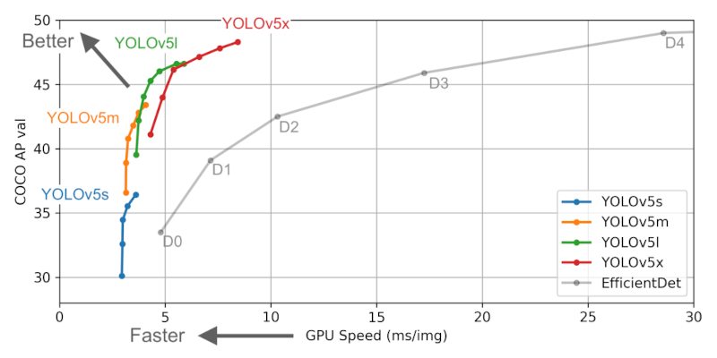
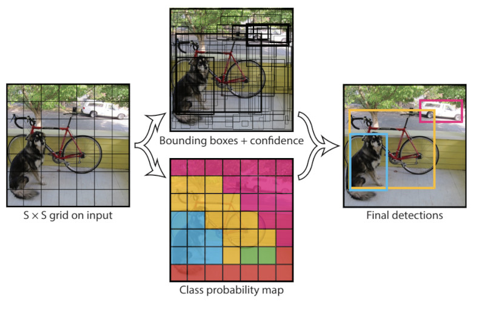
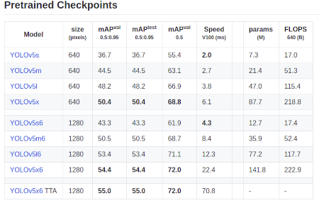

# Signature detection using YOLOv5
## You Only Look Once v5 (YOLOv5)

YOLOv5 is a state of the art object-detection algorithms thats being widely used in academia and industry alike. It is latest version of the versatile and powerful object detection algorithm called YOLO. It outperforms all other real-time object detection models in the world.  

### Working of YOLO

YOLO uses convolutional neural networks instead of the region-based methods employed by alogirithms like R-CNN. The convolutional network *Only Look Once*, ie it requires only one forward pass through the neural network to make predictions. It makes two predictions, the class of object and the position of the objects present in the image.  
YOLO divides an image into `nxn` regions and predicts whether a target class is present in each region or not. It also predicts the bounding box coordinates of the target class. [Non-max suppression](https://towardsdatascience.com/non-maximum-suppression-nms-93ce178e177c) is used to prevent same object being detected multiple times.  
Refer [this video](https://www.youtube.com/watch?v=MhftoBaoZpg) for a better, in-depth understanding of YOLO models. The original YOLO paper could be accessed [here](https://arxiv.org/abs/1506.02640) and YOLOv5 repo could be found [here](https://github.com/ultralytics/yolov5)

### Training On Custom Signature Dataset
**YOLOv5** is available over [this repo](https://github.com/ultralytics/yolov5).  
The data in YOLO format is available [here](https://drive.google.com/drive/folders/1397Q9nqMqEsSesB9UvlIL1u1IGzrUOIK?usp=sharing) as a zip file.  
We use it to train the model to work with the Signature detection use case.  
YOLOv5 requires the dataset to be organized in a particular structure.  
`dataset`  
&nbsp;&nbsp;&nbsp;&nbsp; |-> `images`  
&nbsp;&nbsp;&nbsp;&nbsp;&nbsp;&nbsp;&nbsp;&nbsp;&nbsp;&nbsp;&nbsp;&nbsp; |-> `train` (.jpg files)  
&nbsp;&nbsp;&nbsp;&nbsp;&nbsp;&nbsp;&nbsp;&nbsp;&nbsp;&nbsp;&nbsp;&nbsp; |-> `valid` (.jpg files)  
&nbsp;&nbsp;&nbsp;&nbsp; |-> `labels`  
&nbsp;&nbsp;&nbsp;&nbsp;&nbsp;&nbsp;&nbsp;&nbsp;&nbsp;&nbsp;&nbsp;&nbsp; |-> `train` (.txt files)  
&nbsp;&nbsp;&nbsp;&nbsp;&nbsp;&nbsp;&nbsp;&nbsp;&nbsp;&nbsp;&nbsp;&nbsp; |-> `valid` (.txt files)  
  
Each line of the txt file contains `class` `x_center` `y_center` `width` `height`. Box coordinates are in normalized form. `x_center` and `width` are divided by image_width and `y_center` and `height` are divided by image_height to get a value between 0 to 1.

I have used is the [Tobacco 800](http://tc11.cvc.uab.es/datasets/Tobacco800_1) dataset to train the model. The code to convert `Tobacco 800` dataset could be found [here](Converting_Tobacco800_Dataset_to_YOLOv5_Format.ipynb). Instructions to convert the dataset can also be found in that notebook.  
  
### Training the model
**Use [this notebook](CustomYOLOv5_using_Tobcco800_dataset.ipynb) to train and test the YOLOv5 model.**  
  
Clone the official [YOLOv5 repo] and install the requirements using the `requirements.txt` file.  
We need to create a `tobacco_data.yaml` and add the path of training `train:` and validation `valid:` directories, number of classes `nc:` and class names `['DLLogo', 'DLSignature']` and add this file to the `yolov5` directory we cloned.  

Now, we have to select a pre-trained model from the available pre-trained checkpoints. These `model.yaml` files are present inside `yolov5\models`. I have used `yolov5x` for performing my experiments.  
  
  
**Training arguments**  
`--img 640` is the width of the images.  
`--batch` - batch size>  
`--epochs` - no of epochs  
`--data` - Dataset.yaml (`tobacco_data.yaml`) path  
`--cfg models/model.yaml` is used to set the model we want to train on. I have used yolov5x.yaml, more information could be found [here.](https://github.com/ultralytics/yolov5#pretrained-checkpoints)  
  
**To Train the model**, run the following line.  
> **!python yolov5/train.py --img 640 --batch 16 --epochs 300 --data tobacco_data.yaml --cfg models/yolov5x.yaml --name Tobacco-run**

Many useful tips and information regarding training and testing could be foung [here](https://github.com/ultralytics/yolov5/wiki/Tips-for-Best-Training-Results). **This will helps to clear a good amount of doubts and errors. Also I recommend you to go through the issues section of the repo if you faces any errors or doubts. Legend has it that you will find the solution for your miseries there.**  
  

### Run Inference
**Testing/ Inference arguments**  
`--hide-labels` is used to hide the labels in the detected images.  
`--hide-conf` is used to hide the confidence scores in the detected images.  
`--classes 0, 1`, etc used to detect only the classes mentioned here. For our use case we need only signature class, so use `--classes 1`.  
`--line-thickness` integer used to set the thickness of bounding box.  
`--save-crop` and `--save-txt` used to save the crops and labels.  
`--project` could be used to specify the results path  
  
**To test/run inference on a directory of images.**  
> **!python yolov5/detect.py --source tobacco_yolo_format/images/valid/ --weights 'runs/train/Tobacco-run/weights/best.pt' --hide-labels --hide-conf --classes 1 --line-thickness 2**

**To pedict a single image**  
> **!python yolov5/detect.py --source tobacco_yolo_format/images/valid/imagename --weights 'runs/train/Tobacco-run/weights/best.pt' --hide-labels --hide-conf --classes 1 --line-thickness 2**  
   
